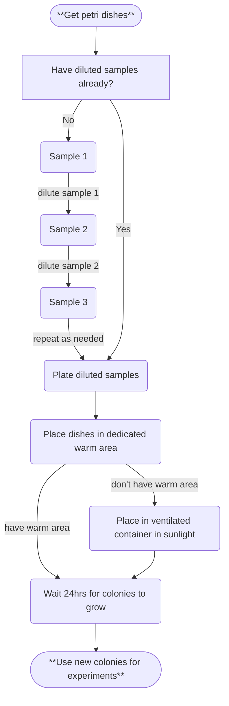

# Mermaid Flowchart
## Growing a bacterial culture
 This is the process of diluting and plating bacterial samples for growth. 

```mermaid
flowchart TD
    A([**Get petri dishes**]) --> B[Have diluted samples already?]
    B --> |No| C(Sample 1)
    C --> |dilute sample 1| D(Sample 2) 
    D --> |dilute sample 2| E(Sample 3)
    E -->|repeat as needed| G

    B --> |Yes| G(Plate diluted samples)
    G --> H(Place dishes in dedicated warm area)
    H --> |don't have warm area| I(Place in ventilated container in sunlight)
    H -->|have warm area| J(Wait 24hrs for colonies to grow)
    I --> J
    J --> K([**Use new colonies for experiments**])
```